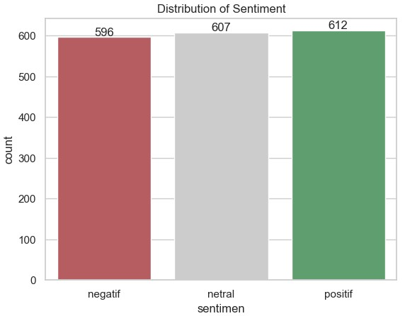
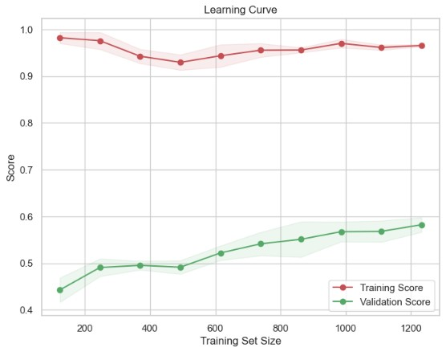

# Project 1: Sentiment Analysis Project

## Intro
Tingkat kesopanan warganet Indonesia memburuk delapan poin ke angka 76, di mana semakin tinggi angkanya tingkat kesopanan semakin buruk. Urutan pertama dihuni oleh netizen Singapura yang juga menempati peringkat keempat secara global, dengan total 59 poin. “Indonesia menempati peringkat 5 pengguna Twitter terbesar di dunia. Posisi Indonesia hanya kalah dari USA, Brazil, Jepang dan Inggris,” Tingkat partisipasi pemilih Indonesia pada Pemilu 2019 sebesar 81,07%. Di posisi pertama adalah Singapura sebesar 95,8%.

## Dataset
Dataset & Background Project Sentiment Analysis bertujuan untuk mengembangkan sistem cerdas berbasis teknologi AI untuk mengklasifikasi sentiment pada twitter dengan metode text analysis. Sistem ini akan membantu memperoleh kecenderungan sentimen opini positif, negatif atau netral pengguna di platform tersebut. Dataset yang digunakan adalah kumpulan tweet dari pengguna twitter saat pelaksanaan Pilpres 2019. Dataset tersebut didapat melalui proses web scraping. Data terdiri dari 1815 tweet yang memuat tiga kategori sentimen: positif, netral, dan negatif.

## Objective Project
- Mendapatkan gambaran opini publik terkait Pilpres 2019 yang akan terlaksana
- Mengukur popularitas kandidat pilpres berdasarkan opini publik
- Insight sentiment analysis pada pilpres 2019 kemungkinan nantinya dapat dikembangkan juga untuk pilpres 2024.

## Processing
Eksperimen dilakukan dengan menggunakan berbagai ragam teknik preprocessing dan vectorization, seperti Text Vectorization (TFIDF). Selain itu juga menggunakan menguji algoritma Random Forest dan LSTM (ditambah hyperparameter tuning untuk model optimization). Setelah itu dilakukan model evaluation dan penarikan kesimpulan untuk memilih algoritma terbaik.

_Explanotary Data Analysis(EDA)_

_Hasil Random Forest setelah hypertuning menggunakan GridSearch_

_Hasil data training (LSTM)_:
- Accuracy  : 0.9959
- Precision : 0.9966
- Recall    : 0.9952
- F1 Score  : 0.9959

_Hasil data testing (LSTM)_:
- Accuracy  : 0.5923
- Precision : 0.5983
- Recall    : 0.5868
- F1 Score  : 0.5925

## Kesimpulan
Modul training is overfitting and based on testing result gave false sentiment conclusion. Hence, need to do next improvement for model training. 

## Solusi 
- Trying change model setup
- Handling slang word
- Make sure pre-processing better
- Try to analyze more when Tokenizing and Padding
- Setup for early stopping