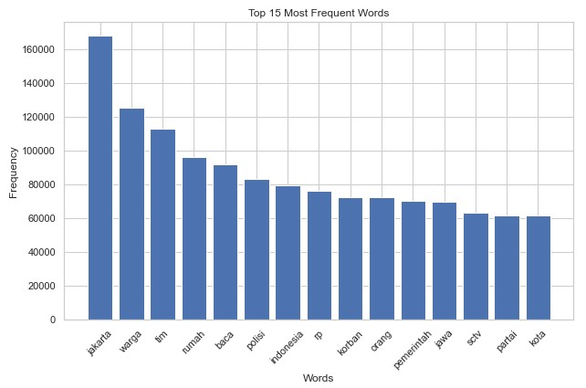
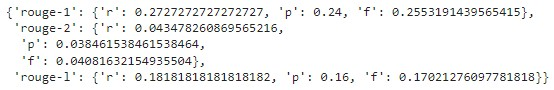
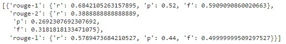

# Project 2: Sentiment Analysis Project
Text summarization adalah metode komputasional yang digunakan untuk merangkum teks menjadi ringkasan yang lebih singkat namun mengandung informasi penting. Teknik ini mengidentifikasi poin-poin kunci, frasa, dan konteks teks untuk menghasilkan ringkasan yang padat dan informatif. Text summarization sering digunakan dalam aplikasi analisis teks untuk membantu pengguna memahami isi dokumen atau artikel dengan lebih efisien. 

## Intro
Liputan6 is an online news portal that provides a large-scale Indonesian dataset for text summarization. The dataset consists of 215,827 document-summary pairs that are used to develop benchmark extractive and abstractive summarization methods over the dataset with multilingual and monolingual BERT-based models. The dataset is useful for researchers who want to develop text summarization models for Indonesian language.

## Dataset
Dataset yang akan digunakan adalah kumpulan data summarization yang berasal dari website Liputan6. Informasi lebih lanjut dari dataset, lihat [disini](https://huggingface.co/datasets/id_liputan6/). Setiap data memuat:
- id: id data
- url: link berita
- clean_article: isi berita
- clean_summary: abstractive summary
- extractive_summary: index extractive summary

## Objective Project
The objective project for text summarization of Liputan6 news is to develop benchmark extractive and abstractive summarization methods over the dataset with monolingual BERT-based models. The project aims to leverage pre-trained language models to create a large-scale Indonesian summarization dataset that consists of 215,827 document-summary pairs. The dataset is useful for researchers who want to develop text summarization models for the Indonesian language. The project also includes a thorough error analysis by examining machine-generated summaries that have low ROUGE scores, and expose both issues with ROUGE itself, as well as with extractive and abstractive summarization models. The Liputan6 dataset is the first large-scale Indonesian corpus for abstractive and extractive summarization, and it is from the year 2000-2010. The project aims to develop a model that can automatically summarize news articles from Liputan6.com, an online news portal, to provide users with a quick and accurate summary of the news.

## Processing
Eksperimen dilakukan dengan menggunakan model algoritma BERT2BERT dan BERT2GPT. Setelah itu dilakukan model evaluation dan penarikan kesimpulan untuk memilih algoritma terbaik. 

## Hasil Metrik Evaluasi
_BERT2BERT_

_BERT2GPT_
