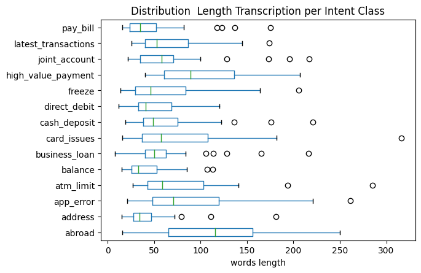
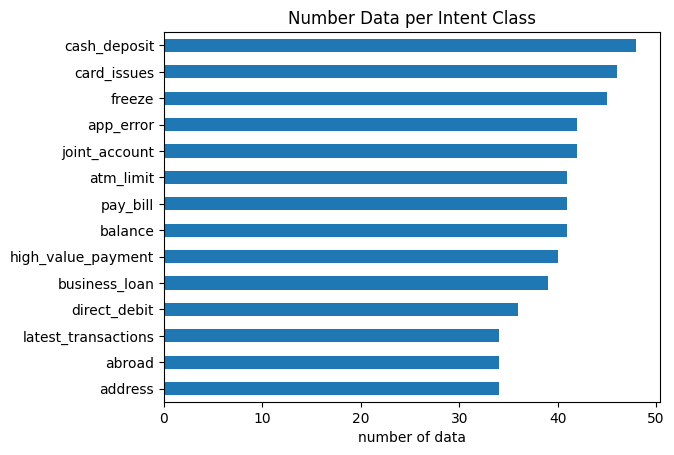

# Project 3: Automatic Speech Recognition
Automatic Speech Recognition (ASR) is a technology that allows human beings to use their voices to speak with a computer interface in a way that, in its most sophisticated variations, resembles normal human conversation. ASR is the use of Machine Learning or Artificial Intelligence (AI) technology to process human speech into readable text. The goal of ASR is to transform a sequence of sound waves into a string of letters or words. ASR is not easy since there are lots of variabilities, such as acoustics, variability between speakers, and variability for the same speaker. The classical pipeline in an ASR-powered application involves the Speech-to-text, Natural Language Processing, and Text-to-speech. ASR is used to transcribe conversations between customers and call center agents or trade floor agents, and the generated transcriptions can then be used for various purposes. As ASR quickly approaches human accuracy levels, there will be an explosion of applications taking advantage of ASR technology in their products to make audio and video data more accessible.

## Intro
Automatic Speech Recognition (ASR) mengonversi sinyal suara menjadi teks, memetakan sequence input audio ke output teks. Asisten virtual seperti Siri dan Alexa menggunakan model ASR untuk membantu pengguna setiap hari, dan ada banyak aplikasi lain yang berguna bagi pengguna seperti pembuatan teks langsung dan pencatatan selama rapat.

## Dataset
MINDS-14 adalah sumber daya training dan evaluasi untuk tugas deteksi intensi dengan data lisan. Ini mencakup 14 maksud yang diambil dari sistem komersial di domain e-banking, terkait dengan contoh lisan dalam 14 ragam bahasa yang beragam, lihat [disini](https://huggingface.co/datasets/PolyAI/minds14). Dataset ini mencakup 14 intensi yang diambil dari sistem komersial di domain e-banking, sebagai berikut:
- ABROAD
- ADDRESS
- APP_ERROR
- ATM_LIMIT
- BALANCE
- BUSINESS_LOAN
- CARD_ISSUES
- CASH_DEPOSIT
- DIRECT_DEBIT
- FREEZE
- HIGH_VALUE_PAYMENT
- JOINT_ACCOUNT
- LATEST_TRANSACTION
- PAY_BILL

## Objective Project
ASR dikembangkan untuk membantu manusia dalam berinteraksi dengan perangkat secara verbal, meningkatkan aksesibilitas, meningkatkan akurasi, membantu pembelajaran bahasa kedua, meningkatkan pengalaman pelanggan, meningkatkan efektivitas, dan meningkatkan produktivitas dalam berbagai aplikasi

## Processing
Eksperimen dilakukan dengan menggunakan algoritma Pre-Trained Model yaitu Wav2Vec2, Whisper, dan HuBERT (Hidden Unit BERT). Setelah itu dilakukan model evaluation dan penarikan kesimpulan untuk memilih algoritma terbaik. Metriks evaluasi yang digunakan ialah WER (Word Error Rate) & CER (Character Error Rate).

## Evaluation Metrics
_Whisper - Sample 1_
- WER: 0.0 
- CER: 0.0

_Whisper - Sample 4_
- WER: 0.25 
- CER: 0.1

_Wav2Vec2 - Sample 1_
- WER: 0.0 
- CER: 0.0

_Wav2Vec2 - Sample 4_
- WER: 0.25 
- CER: 0.17

_HuBERT - Sample 1_
- WER: 0.0 
- CER: 0.0

_HuBERT - Sample 4_
- WER: 0.12 
- CER: 0.07

## Solusi 
- Remove the background noises
- Some transcriptions from the dataset are not accurate, need to review in depth
- Fine-tune the model on larger data
